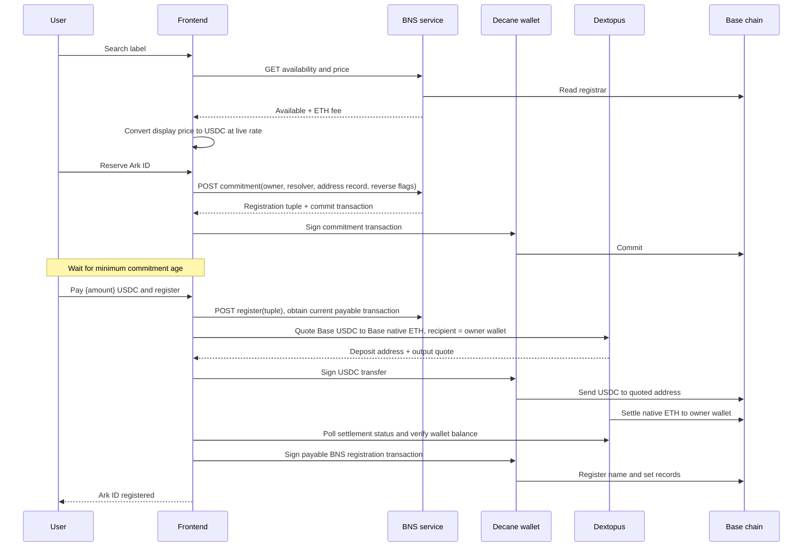
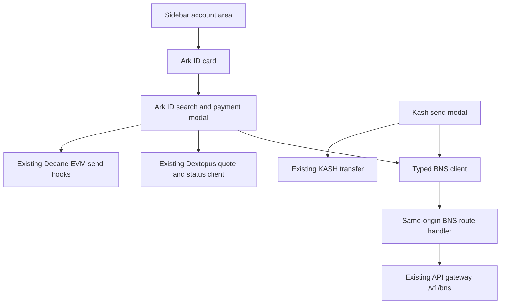

# ADR: Ark ID and USDC-Denominated Name Payments

- **Status:** Proposed, awaiting maintainer approval
- **Date:** 2026-09-26
- **Scope:** Frontend only. No BNS, Kash, gateway, or contract backend changes.

## Context

The frontend needs to integrate the existing BNS service for `.ark` names. An Ark ID should be discoverable from the account area, resolve to its owner's wallet, and be accepted as a Kash recipient. Name registration is an annual subscription-like payment that contributes revenue to the platform.

The BNS service builds unsigned transactions and does not custody funds. Name registration uses commit/reveal: the client sends a zero-value commitment transaction, waits for the store's minimum commitment age, then sends a payable registration transaction. The `registration` tuple returned by the commitment endpoint contains the only copy of the reveal secret and must be persisted by the client until registration completes or expires.

BNS exposes standalone availability and price reads. The aggregate label-status endpoint also reads label expiry; a chain failure in that auxiliary read currently fails the whole aggregate response. Recipient resolution is a separate `/resolve/:name` read that returns the address record, resolver, and registry owner.

The UI must present one currency to customers. The BNS contract's registration transaction is payable in native Base ETH, while Dextopus can quote a same-chain Base-USDC route to native Base ETH. That conversion is asynchronous and is a distinct transaction from the later BNS registration transaction.

## Decision

1. Add a compact Ark ID entry above the account control in the frontend sidebar. The Ark ID sheet displays the user's verified name when one exists, offers manual yearly renewal, and permits a new name to be searched.
2. Normalize entered labels to lowercase and append `.ark` exactly once. Use separate BNS `/available` and `/price` reads for search; do not make search depend on the aggregate endpoint's expiry read.
3. Register the connected wallet's address record and reverse record with the BNS commitment. Persist the full returned registration tuple, including its secret, in browser storage keyed by wallet and label. Remove it after successful registration or expiration. Do not send the tuple to any new backend storage.
4. Accept either an EVM address or an Ark ID in Kash send. Resolve `.ark` names through BNS and allow the transfer only when the BNS resolver returns a valid address. A missing/unresolvable address is an error state with a link to Ark ID purchase. Preserve direct-address behavior.
5. Display name prices in USDC using the live ETH/USD price. At the reveal step, one customer-facing action quotes a Base-USDC-to-native-Base-ETH route, sends the exact USDC quote through the existing Dextopus integration, waits for terminal settlement and verifies the resulting wallet balance, then builds and sends the payable BNS registration transaction. Renewal follows the same payment path.
6. Keep the same modal in a blocking progress state during the user-started payment flow. Persist the Dextopus request id and payment metadata so the flow can be resumed after a reload. Failed/refunded payments preserve the name commitment and allow a retry; timeouts preserve the request for later continuation.
7. Use USDC-only product copy. Do not name Dextopus or native ETH in the Ark ID interface. The browser wallet may still show the native ETH value on the final on-chain registration confirmation, because that is the BNS contract's payment unit.
8. Add a frontend same-origin BNS proxy with a narrow endpoint allowlist. BNS writes require the existing request-session verification; the BNS service remains the source of transaction calldata and chain validation.

## User Flow

## Component Boundaries

## Consequences

### Benefits

- Users see prices and payment progress in the product's single displayed currency, USDC.
- Kash transfers to names use the authoritative BNS address record rather than trusting user-entered aliases.
- The frontend avoids making availability dependent on the unrelated expiry read.
- BNS and Dextopus remain non-custodial; the frontend only coordinates unsigned transactions and status reads.
- The commit/reveal secret remains client-side and can survive a page reload.

### Costs and Risks

- Commit/reveal cannot be represented as one immediate transaction. Registration starts with a reservation signature and requires a later reveal after the contract's minimum age.
- The post-reveal payment flow includes a USDC transfer signature, asynchronous settlement, and a separate registration signature. “One button” means one customer-facing action and one progress flow, not one wallet authorization or an atomic transaction.
- The wallet may expose the underlying native-ETH value when asking the user to sign the final contract call, even though the app's own price and progress UI is USDC-denominated.
- Dextopus settlement delays, unsupported routes, USDC insufficiency, stale rates, or provider outages can delay completion. The flow must retain the request and registration tuple and never claim completion before both settlement and registration are confirmed.
- The displayed USDC price is an estimate from the current ETH/USD rate. The Dextopus quote is authoritative for the actual USDC transfer and must be shown/verified before that transfer is signed; it must deliver at least the BNS payable amount after slippage.
- Browser storage of the registration secret is necessary because the BNS service is stateless. It inherits the frontend origin's local-storage security model and must be cleared on completion/expiry.

## Verification Requirements

- Unit tests for `.ark` normalization, address record calldata, integer USDC fee conversion, and durable registration storage.
- UI tests for availability, price errors, reveal waiting, USDC payment progress, resumability, success and failure states.
- Kash send tests proving valid Ark resolution sends to the resolved address and unresolved names cannot submit.
- Verify every BNS read and write against the published OpenAPI contract, especially that individual `/available` and `/price` responses validate.
- Validate the actual Dextopus quote's output asset is native Base ETH and that its minimum output covers the current BNS `tx.value` before sending USDC.
- Run the frontend's five quality gates and manually exercise a full commit/reveal/payment flow against Base test fixtures or an approved test environment. Production mainnet transactions are not an acceptable test.

## Implementation Revisions (2026-09-26)

Refinements that emerged during build. They supersede the corresponding points above where they differ.

1. **One Ark ID per wallet.** The sheet's search-and-buy flow renders only for a wallet that does not already hold a verified name. An owner sees their identity confirmation and no path to a second purchase. This supersedes the open-ended "permits a new name to be searched" in Decision 1.
2. **Renewal is gated to near-expiry, never offered on an active name.** Decision 1's "offers manual yearly renewal" and Decision 5's "Renewal follows the same payment path" are corrected: a name is paid for a full year at purchase, so a renewal control on an active name only ever charges a year no one needs (this shipped briefly and cost a user real money). Renewal now appears only within `RENEWAL_WINDOW_DAYS` (60) of the on-chain expiry, read from the dedicated `GET /stores/ark/labels/{label}/expires` endpoint (Unix seconds), and it is a two-step confirm so it can never fire on a single tap. Outside that window the sheet shows only the real expiry date. The `/available` read does not carry expiry; the earlier "aggregate label-status endpoint" is not used.
3. **Reverse (primary) name is set with a dedicated transaction.** The registration reverse flag does not write to the `DefaultReverseRegistrar` that `/reverse` reads, so registration alone leaves the wallet with no discoverable primary name. After a successful register the client sends an explicit, gas-sponsored `setName` to the default reverse registrar. Ownership everywhere keys off the verified `/reverse` result. A "set as primary name" recovery action covers names registered before this was added (detected by resolving the searched name's owner to the connected wallet).
4. **Upfront balance gate.** The USDC balance is checked against the quoted price before the reserve and pay actions are enabled, so a wallet that cannot cover the name is stopped before any signature rather than mid-flow.
5. **Gas is fully sponsored.** Registration, renewal, reverse `setName`, and the funding transfer are sponsored, so the UI shows only the name price. No gas figure or gas-inflated total is presented.
