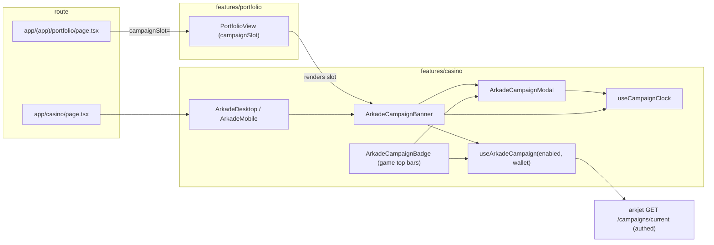

# ADR: Arkade campaign banner, and a landscape campaign modal

- **Status:** Accepted 2026-09-30
- **Date:** 2026-09-30
- **Scope:** Frontend only. No arkjet, gateway or contract change. Reads the existing `GET /campaigns/current` journey.

## Context

PR #588 shipped the weekly Arkade campaign ("7-Day Triple Challenge"): a
`92x25px` badge in the top bar of the Arkjet, Chicken Cross and Spin da'
Bottle screens ("Ends in 6d", gift, `0/3`) that opens a campaign modal. The
modal is `arkade-campaign-badge.tsx` (348 lines) plus a 672-line CSS module;
the panel is pinned to `360px` wide at every viewport, so on a desktop it is
a phone sheet floating in the middle of a 1500px page. The modal is only
reachable from inside a game, so a player who has not opened Arkjet this week
never learns the campaign exists.

Facts that shape the design:

- The journey (`ArkadeCampaignJourney`) is one authed read,
  `arkjet.authedGet("/campaigns/current")`. It needs the session, not the
  arkjet `playerId`; the badge only used `playerId` as the cache key and as
  the "identity is known" gate. `useArkadeCampaign(enabled, playerId)` polls
  every 5 s while the campaign is `active` or `upcoming`.
- `features/portfolio` may not import `features/casino`. The portfolio route
  already composes a casino-owned element into the view through a slot prop
  (`updateBalanceSlot`), which is the pattern for putting a campaign surface
  on the portfolio page.
- `ArkadeDesktop` and `ArkadeMobile` are `features/casino` components, so the
  Arkade page can render a campaign surface directly.
- `ModalShell` sizes desktop panels through `size: "md" | "lg"` (440 / 600px)
  and accepts `panelClassName`; the campaign CSS already overrides it with
  `!important` to reach 360px.
- The modal's copy is hardcoded English. The rest of the app is five-locale.

## Decision

1. **Split the modal out of the badge.** `arkade-campaign-modal.tsx` exports
   `ArkadeCampaignModal({ open, onClose, journey, seconds })`, the panel the
   badge already renders, unchanged in content. The badge becomes a thin
   trigger for it. A `useCampaignClock(journey)` hook moves to
   `campaign/campaign-clock.ts` so every surface counts the same seconds.

2. **One cache for every surface.** `useArkadeCampaign(enabled, wallet)` is
   keyed by the session's `evmAddress` instead of the arkjet `playerId`. The
   wallet is the identity the request is authenticated as; `playerId` is
   derived from it server-side. The gate "do not fire the private query until
   identity is known" is kept: `enabled` requires `ready && authenticated &&
evmAddress`. The badge, the banner on the portfolio page and the banner on
   the Arkade page then share one query and one 5 s poll.

3. **Landscape modal from `md` up.** The panel becomes `min(920px, 100%)` wide
   and lays the body out as two columns: left, the prize hero (prize badge,
   countdown, the three step marks, the progress track, the entry state);
   right, the three mission rows and the fair-draw details. Below `md` nothing
   changes: the current sheet stays as it is. The `!important` overrides
   remain confined to the module and are narrowed to what the shell does not
   expose.

4. **A campaign banner, `ArkadeCampaignBanner`.** One component, responsive,
   rendered in two places: at the top of the Arkade page above the featured
   game (desktop and phone), and on the portfolio page above the balance row
   (both layouts), composed by the route through a new `campaignSlot` prop on
   `PortfolioView`. The whole banner is one button that opens the modal. It
   renders nothing when there is no session, no campaign, or the campaign is
   `cancelled`, so a page without a campaign is unchanged.

5. **The banner's design.** A poster ticket, not another card. Direction taken
   from what works on Stake's weekly races, the Game UI Database's season and
   timed-reward screens, and battle-pass reward rails: one bold prize figure,
   a live countdown, a milestone track with a reward at its end, and one
   action. Concretely, on the campaign's own crimson (`#71101e` to `#281015`)
   with the app's gold (`#FFE178` / `#C58A12`) for the prize:

   - A prize medallion on the left: the gift box on a soft halo with the
     `$50` coin tag, drawn larger than the modal's, with a slow sheen.
   - The title in the display face at poster size, and one line that says
     what to do: "Hit 11.50x on Arkjet and Chicken, win 4 in a row on Spin".
   - A milestone track: three round marks `J`, `C`, `S` joined by a dotted
     connector, filling gold as each completes, ending on a small gift; a
     `n/3` figure beside it.
   - A countdown pill (`Ends in 6d 2h`) on a live clock, and a chrome
     `See missions` pill in the same brushed fill the Arkade featured banner
     uses for `Play now`, so the two banners read as one family.
   - The big `A` watermark and a diagonal light sweep, both CSS; a faint
     scatter of gold sparkles as CSS radial gradients. No image assets.
   - Qualified state: the crimson turns to the modal's amber, the track is
     full, the pill reads `Entry secured`.
   - Phone: the medallion and the words share the top row, the track and the
     pill stack under them; the banner keeps a fixed aspect so nothing shifts
     as the clock ticks. `prefers-reduced-motion` stops the sheen.

6. **Copy in five locales** for everything the banner says (title lead-in,
   the one-liner, countdown prefixes, `See missions`, `Entry secured`,
   `n of 3`). The modal's existing hardcoded English is out of scope for this
   PR and noted as debt.

## Component diagram

## Trade-offs

- Keying the query by wallet rather than `playerId` means the badge fires a
  hair earlier than before (as soon as the session is up, not after the
  balance read). The request was always authenticated by the session, so
  nothing new is exposed; the test that guards the gate is kept and reworded.
- Two mounts of the banner (Arkade page and portfolio) never coexist on one
  route, and if they did they would share the cache. The modal is mounted per
  trigger, as the badge does today; only one can be open.
- The landscape layout duplicates nothing: it is the same DOM under a grid
  from `md`, so the two breakpoints cannot drift apart in content.

## Alternatives considered

- **Reuse the featured banner slot** for the campaign. Rejected: that banner
  spotlights one game and pages through several; the campaign needs its own
  presence, above it.
- **A `NEXT_PUBLIC` flag or a `KASH`-style banner in the promo rail.**
  Rejected: the rail's tickets are 6:1 strips with two lines of text; the
  campaign needs a track, a clock and a button.
- **Keep the modal at 360px and only add the banner.** Rejected by the ask.

## Verification

- Unit: banner renders the journey's figures, opens the modal on click,
  renders nothing without a campaign or session; modal gets the landscape
  class and the two columns from `md`; the portfolio view renders the slot
  above the balance row in both layouts; the badge still opens the modal and
  still waits for identity.
- Preview: portfolio and Arkade on a 1440px desktop, an iPad and a phone;
  open the modal from the banner and from a game badge; watch the countdown
  tick without layout shift; check the qualified state with a test journey.
