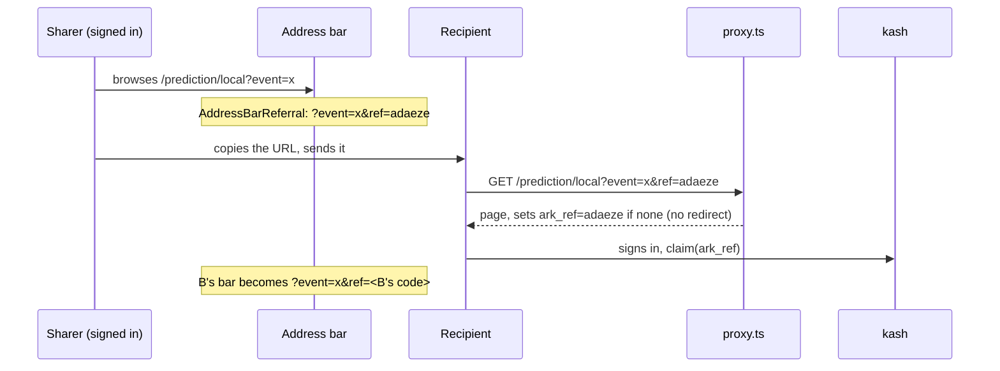

# ADR: The referral code lives in the address bar

- **Status:** Accepted 2026-10-01 by the maintainer
- **Date:** 2026-10-01
- **Scope:** Frontend only: the session shell and the middleware. No kash change.

## Context

A signed-in user's referral code reaches a shared link only through a share
button (`withReferral`, `ShareLinkButton`, #589). Many pages have none (the
first-party sportsbook, most market pages), and people mostly share by
copying the address bar, so those links credit nobody.

How a code is captured today: `proxy.ts` sees `?ref=<code>` on any page,
sets the `ark_ref` cookie (30 days, never overwriting an existing one), and
**redirects to the same URL without `ref`**, so a visitor could not pass on
somebody else's code. After sign-in the claim posts the cookie's code to kash
(`POST /referrals/claim`), which refuses self-referral
(`referrals.service.ts:145`) and is first-claim-wins.

Verified facts that shape the design:

- This Next.js version integrates `window.history.replaceState` with the App
  Router (`usePathname`/`useSearchParams` stay in sync), per the installed
  docs (`02-guides/single-page-applications.md`, "Native History API").
- `useReferralCode()` already resolves the signed-in wallet's code (username
  first, auto-provisioned code otherwise) from one cached query.
- Page views are tracked by page name, not URL, so a `ref` in the URL does
  not split analytics.

## Decision

1. **`AddressBarReferral`**, a client component mounted once in the session
   providers, keeps `?ref=<own code>` on the current URL for a signed-in user
   with a code. It runs on every pathname or query change and calls
   `window.history.replaceState(null, "", url)` only when the `ref` in the
   address differs from the user's code. No reload, no history entry. Other
   query parameters and the hash are kept. It writes nothing while signed out,
   while the code is unknown, or on `/auth`, `/interests`, `/legacy-export`
   and `/r/*`. It reads `useSearchParams`, so it mounts inside `<Suspense>`.

2. **The user's own code replaces any `ref` already in the bar.** A recipient
   who opens a shared link and is signed in sees their own code at once; what
   they share next credits them. The sharer was already captured by the
   cookie.

3. **The middleware stops stripping `ref`.** It still sets the cookie under
   the same rules (valid code, never overwrite) but no longer redirects, and
   the cookie is attached to whatever response the rest of the middleware
   produces, so the launch and maintenance gates behave as before. Without
   this, every refresh of a page carrying the code would bounce through a
   redirect.

4. A pure helper, `addressWithReferral(href, code)` in `lib/referral-code.ts`,
   builds the new URL; the component holds no logic of its own.

## Consequences

- Every copied link from a signed-in user carries attribution.
- A visitor's address bar shows the sharer's code until they sign in. That is
  harmless: the cookie already holds it, and signing in swaps it.
- Self-referral by refreshing one's own link sets the cookie to one's own
  code, which kash refuses at claim time.

## Alternatives considered

- **Share buttons on every page.** Still worth adding, but does not cover the
  address bar, which is how most links are shared.
- **Rewrite every `<Link>` href.** Touches every link in the app and still
  misses the bar after a manual navigation.

## Verification

Unit: the helper (adds, replaces, keeps other params and hash, ignores invalid
codes); the component (writes once, no-ops when equal, nothing signed out or
on excluded paths); the middleware (cookie rules unchanged, no redirect, gates
unchanged). Preview: copy the URL from a market and a game page signed in,
open it in a private window, sign up, confirm the referral in the network.
