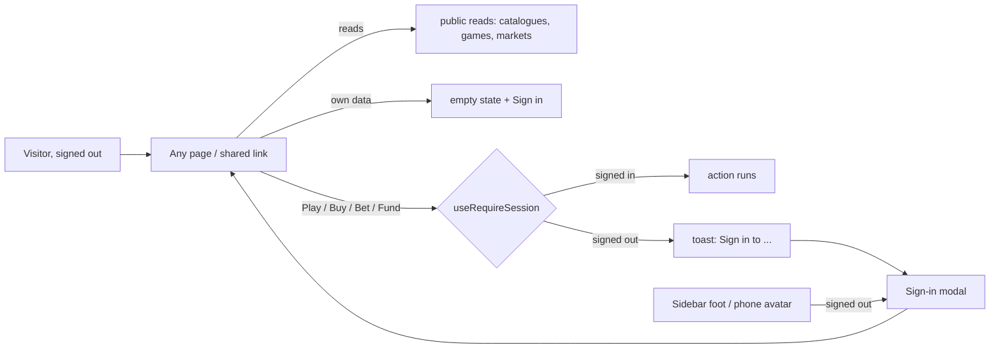

# ADR: Browse first, sign in to act

- **Status:** Accepted 2026-10-02 by the maintainer
- **Date:** 2026-10-02
- **Scope:** Frontend: the session shell, every page's signed-out state, the
  action entry points, three proxies. No backend change required.

## Context

Today a visitor must sign in before they can see anything. The maintainer
wants the opposite: every page's content is open, a shared link (a market,
a private Last Man game, a chess round) shows the real thing to whoever opens
it, and only an action that moves money or plays needs a session. Signed
out, attempting one shows a toast inviting sign-in, which opens the sign-in.
The account button at the foot of the rail becomes a **Sign in** button.

### Audit of `main` @ `943544ce` (2026-10-02)

**Where the wall is.** `AuthGuard` (`components/auth/auth-guard.tsx`)
redirects to `/auth` and renders nothing meanwhile. It is mounted in five
places, and those five are the only page gates:

| Mount                                                        | Covers                                                                                                                                                |
| ------------------------------------------------------------ | ----------------------------------------------------------------------------------------------------------------------------------------------------- |
| `components/layout/app-shell.tsx`                            | the `(app)` group: portfolio, dashboard, spot, spot/[id], meme, rwa, prediction (+ /[id], /event/[id], /local, /markets), activity, referrals, ark-id |
| `features/casino/components/casino-page.tsx`                 | every game: Arkade hub, Last Man (lobby + /[gameId]), Arkjet, Chicken, Spin, ArkBall, chess hub pages                                                 |
| `features/casino/components/chess-app/chess-lobby-frame.tsx` | chess lobby, invite, swiss, tournaments                                                                                                               |
| `features/earn/components/earn-page.tsx`                     | Earn                                                                                                                                                  |
| the pages themselves                                         | `/market`, `/perps`, `/trade/[symbol]`, `/interests`                                                                                                  |

The middleware (`proxy.ts`) does not gate auth.

**What a page needs to render signed out.** Of 75 API routes: 41 are public,
25 need a session for everything, 9 are mixed (public reads, session
writes). Checked route by route against what each page calls:

| Area                                         | Reads a signed-out page needs                                                                            | Today                             | Needed                                                                                   |
| -------------------------------------------- | -------------------------------------------------------------------------------------------------------- | --------------------------------- | ---------------------------------------------------------------------------------------- |
| Last Man (incl. private games by link)       | `vault/lobby`, `vault/status`, `vault/leaderboard`, `vault/privacy`, `vault/[...path]`, the vault socket | public                            | nothing                                                                                  |
| Arkjet                                       | `capabilities`, `rounds/*`, `activity/simulated/*`, `fairness/*`, `risk/rules`                           | public (`PUBLIC_READ`)            | nothing                                                                                  |
| Chicken                                      | `chicken/rules`, `chicken/proofs/*`                                                                      | public                            | nothing                                                                                  |
| Spin da Bottle                               | rules, proofs, rounds; comments are session-only                                                         | public                            | nothing; chat stays signed-in only                                                       |
| Chess                                        | lobby, games, watch, puzzles, studies                                                                    | mixed, by `chessReadNeedsSession` | verify each hub page's reads during build; open any that only need a session by accident |
| Spot, Memecoins                              | `trade/[...path]`, `market-tokens`, `chart`, `prices`                                                    | public                            | nothing                                                                                  |
| Prediction (markets, book)                   | `prediction/[...path]`, `predictions`, `sportsbook` public gets                                          | public                            | nothing                                                                                  |
| Prediction combos                            | `prediction-combos`: only `house/tickets` needs a session                                                | mixed                             | nothing                                                                                  |
| Leverage trading                             | `perp/[...path]` GETs                                                                                    | public (POST only verified)       | nothing                                                                                  |
| Real assets                                  | `rwa/[...path]` GETs public, but `rwa-prices` (POST) and `rwa-chart` (GET) need a session                | **session**                       | open `rwa-prices` and `rwa-chart` reads                                                  |
| Portfolio, Arkivity, Referrals, Ark ID, Kash | `portfolio`, `activity`, `kash` (mine), `bns`                                                            | session                           | none: these are the user's own; signed-out empty states                                  |
| EVM RPC (`evm-rpc`)                          | used by trade receipts, sponsorship, Polymarket config                                                   | session                           | none: only used while acting                                                             |

**Where the actions already branch.** About fifteen call sites already
handle "signed out" with `login = () => router.push("/auth")`: Arkjet,
Chicken, Spin (`use-*.ts`), chess arena create/detail, spectator betting,
the prediction slips and the sportsbook. They become the gate's first
consumers.

## Decision

1. **Open every page.** `AuthGuard` keeps only the idle sign-out (signed
   in) and stops redirecting and holding back. Removed from `CasinoPage`,
   `ChessLobbyFrame`, `EarnPage` and the per-page mounts. **Session-only:**
   the account upgrade (migration gate and `/legacy-export`), because
   upgrading is an act on the account. `/auth` stays as the sign-in page.

2. **Remove the interests page.** `/interests` redirects to `/dashboard`
   and sign-in no longer routes new users to it; the interest-based
   reordering in `lib/sections.ts` goes, so the sidebar keeps its default
   order. The **dashboard page's sections** get a fixed order (clarified by
   the maintainer): the balance cards, then **Arkade, Join the Conversation,
   Prediction, Real assets, Memecoins**, then the rest. Delivery: staging first, tested
   there, then `main`; staging is first levelled with `main`.

3. **Sign in in the shell.** Signed out, the rail's account button (foot of
   the sidebar) and the phone topbar's avatar become a **Sign in** button,
   opening the sign-in in a modal (`ModalShell` around the body of
   `app/(session)/auth/page.tsx`). After signing in the user stays on the
   page they were on.

4. **Gate actions, not pages.** One hook, `useRequireSession()`, returns
   `ensure(): boolean`. Signed in, it returns `true`. Signed out, it shows a
   toast ("Sign in to play" / "...to buy" / etc., one string per action
   family) with a **Sign in** action that opens the modal, and returns
   `false`; the caller stops. Every money or play entry point calls it
   first: game stakes and play buttons (Last Man start/wager, Arkjet,
   Chicken, Spin, ArkBall tickets, chess create/join/bet), spot and meme
   buy/sell, prediction and sportsbook bet slips, leverage orders, RWA buy,
   Kash buy/send/convert, Add funds, Withdraw, Ark ID purchase, referral
   username claim. The existing `login()` branches are replaced by it.

5. **Signed-out states.** Balance card: `$0.00` with "Sign in to see your
   balance"; Add funds and Withdraw go through the gate. Kash card, holdings,
   Arkivity, referrals, Ark ID: an empty state with a Sign in button, no
   spinner waiting on a session that will not come. Game balances read
   `$0.00`. Copy in five locales.

6. **Open the two RWA reads** (`/api/rwa-prices`, `/api/rwa-chart`) the RWA
   page needs to render; they are market data, not the user's. Any chess
   hub read found during the build to need a session only by accident is
   opened the same way, with a test per route.

## Consequences

- Shared game and market links show the real thing; sign-in moves to the
  moment of intent.
- Every write path must call the gate. A missed one fails safely (its
  proxy still answers 401) but with a worse message, so the gate list above
  is the PR checklist, with a test per entry point.
- Signed-out traffic to public reads grows; those routes already carry
  their own caches.
- The onboarding interest choice is gone; the section order is the same
  for everyone.

## Alternatives considered

- **Sign-in page per action** (today's `router.push("/auth")`): loses the
  page and the intent; the modal keeps both.
- **Keep the guard and allowlist public pages:** inverts the default the
  wrong way; every new page would be closed until someone remembered.

## Plan of work (after approval)

One worktree, landed in reviewable steps, staging first:

1. Shell: guard opened, Sign in button (rail + phone), sign-in modal,
   `useRequireSession`, toast copy, interests removed and section order
   fixed. Portfolio signed-out states.
2. Games: gate every play/stake entry point (replacing the `login()`
   branches); verify each game renders live signed out, including a private
   Last Man game opened by link.
3. Markets: spot, meme, prediction, sportsbook, perps, RWA buy/sell/bet
   gated; open the RWA reads.
4. Money: Add funds, Withdraw, Kash, Ark ID, referrals.

Each step red-green: a test per entry point that signed out it toasts and
does not act, signed in it acts.

## Verification

Signed out in a private window: every nav page renders; a private Last Man
link shows the running game and its clock; Arkjet and Chicken rounds play
out; a market and a fight are browsable. Each action toasts and opens the
sign-in; after signing in, the action is available on the same page.

## Addendum 2026-10-03: Add funds wherever the balance is short

Requested by the maintainer on 2026-10-03. Someone who opens a shared link,
signs in and is told their balance is too low should be able to fund right
there and carry on, not go hunting for the balance card.

**Rule.** Every place that says the balance is short for a play, trade, bet
or purchase shows an Add funds control next to that message. When the
shortfall only reaches the user as a toast, the toast carries an Add funds
button.

**Mechanism.** One deposit modal for the whole session, opened through a
small store (`hooks/use-funds-modal.ts`), the way the sign-in modal is. The
host sits in the session providers, so it works on every route, including
those that render their own shell (casino, chess, earn, perps, prediction).
`useAddFunds()` asks for a sign-in first when there is no session. Routes
that already compose `useAppModals` keep their own funds sheet; nothing is
threaded through props for the new surfaces.

**Out of scope.** Shortfalls a deposit cannot fix: selling more of an asset
than is held, and KASH sends or conversions above the KASH balance. In-game
cashiers (Arkjet, Chicken, Spin) already route a short wallet to the deposit.
